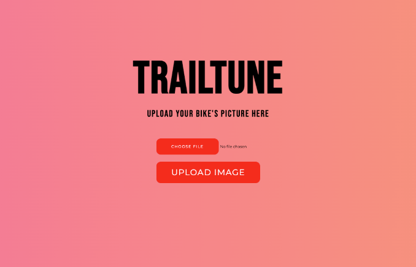

#TrailTune - An ATV Maintenance Web App with YOLOv8 Object Detection

[](https://www.youtube.com/watch?v=RnhT2BPxIC0)

## Overview

TrailTune is built to support quad bike owners with the maintenance of their vehicles. Owners can take pictures of their bikes from different angles, upload them to the web app and see what maintainable parts were detected, along with the procedure to servicing them.

## Installation

```bash
git clone https://github.com/yourusername/atv-detection-app.git
cd atv-detection-app
pip install -r requirements.txt
```
## Running the App

```bash
   python run.py --port 8080 --debug
```
